# PocketFiles

[](https://github.com/EmirageCS/pocketfiles/actions/workflows/ci.yml)

A secure mobile file manager built with Flutter — COM206 Visual Programming Mid-Term Project.

---

## Research Problem

Phones hold some of our most private files — scanned IDs, personal photos, financial documents. Yet the built-in Files app on Android and iOS has zero access control. Anyone who picks up your phone can open any folder, no questions asked.

Existing "vault" apps either require cloud sync, root access, or offer such a thin layer of security that a single guess breaks through. There is no middle ground: something simple to use daily, that actually protects your data locally, with no account required.

**This project asks:** Can a mobile app provide real, folder-level privacy — individual PIN locking, brute-force protection, and a recovery path — while staying lightweight and fully offline?

---

## Motivation

The idea came from a simple, frustrating situation: handing your phone to someone to show them one thing, and knowing they can wander into anything else. Repair shops, shared households, even just unlocking your phone in public — there are moments where certain folders should stay closed.

PocketFiles was built around that need. No cloud, no account, no third-party servers. Everything stays on the device, protected with bcrypt-hashed PINs. Each folder is independently lockable, so you decide what's private and what isn't — not the app.

The secondary goal was to prove that security and usability don't have to fight each other. The app should feel as natural as the stock Files app on a good day, just with a lock on the door.

---

## Control Flow

```
App Launch
│
├─► First launch? ──► Help / Onboarding Screen ──► Home
│
└─► Home Screen (folder grid + search bar)
    │
    ├─► New Folder
    │   └─► enter name + pick color ──► INSERT into SQLite ──► grid refreshes
    │
    ├─► Tap folder
    │   ├─► Unlocked ──► Folder Detail Screen
    │   │               ├─► Add Files (multi-select picker)
    │   │               │   └─► copy to app directory ──► INSERT into DB ──► list refreshes
    │   │               ├─► Tap file ──► open with native OS app
    │   │               ├─► Swipe right ──► share via system share sheet
    │   │               ├─► Swipe left ──► confirm ──► delete from disk + DB
    │   │               └─► per-file menu ──► Open / Share / Rename / Delete
    │   │
    │   └─► Locked ──► Unlock Dialog
    │                   ├─► Enter PIN ──► bcrypt.verify()
    │                   │   ├─► Match ──► record unlock ──► open folder
    │                   │   └─► Wrong ──► log attempt ──► 3 fails = 60-sec lockout
    │                   └─► Forgot PIN? ──► security question ──► bcrypt.verify()
    │                        └─► Match ──► open folder
    │
    ├─► Search icon ──► Global Search Screen
    │   └─► type query ──► search files across ALL folders ──► tap to open
    │
    ├─► Long-press folder ──► Rename / Delete / Change Color / Set PIN / Remove PIN
    │
    └─► overflow menu ──► Sort folders / Theme / Help / Settings
                          └─► Settings ──► Master PIN (unlocks any folder)
```

---

## Implementation Strategy

**Language & Framework:** Dart / Flutter 3.41.4
**Local Storage:** SQLite (`sqflite`) with 8 migration versions
**Architecture:** Controller–View separation (MVVM-inspired)

---

The app is divided into three layers that never cross-call each other:

**Screens — View layer**
Screens contain only UI code. They listen to a controller via `addListener` + `setState` and call controller methods on user actions. No screen ever touches the database or file system directly.

**Controllers — Logic layer**
`HomeController` handles the folder list, search, sort, and folder CRUD. `FolderController` handles file operations, PIN verification, and reordering within a single folder. Both extend `ChangeNotifier` — state changes call `notifyListeners()` and the UI rebuilds automatically. Because controllers receive their services via constructor injection, they can be tested without a real device or database.

**Services — Data layer**
`StorageService` is a SQLite singleton — all queries go through it. `FileService` handles everything that touches the file system: picking files, copying them into the app's sandboxed directory, sharing, and deletion. Both implement abstract interfaces so tests can swap them with mocks.

---

**Security decisions:**

- **bcrypt at cost 10** — each hash takes ~100ms intentionally. Fast enough for the user, slow enough to make brute-force attacks impractical.
- **Background isolate** — hashing runs via `compute()` so the UI thread never blocks during verification.
- **Atomic lockout** — failed attempts are logged and counted inside a single SQLite transaction, closing a race condition that could let rapid guesses bypass the counter.
- **FLAG_SECURE** — set on Android at launch. Prevents the OS from allowing screenshots or screen recording of the app.

---

**Project structure:**

```
lib/
├── main.dart
├── controllers/
│   ├── home_controller.dart       # folder list, search, sort, CRUD
│   ├── folder_controller.dart     # file ops, PIN unlock, reorder
│   └── theme_controller.dart      # light / dark / system theme
├── models/
│   ├── folder_model.dart
│   └── file_model.dart
├── screens/
│   ├── home_screen.dart
│   ├── folder_detail_screen.dart
│   └── search_screen.dart
├── services/
│   ├── storage_service.dart       # SQLite singleton
│   ├── file_service.dart          # file I/O
│   ├── i_storage_service.dart     # interface for mocking
│   └── i_file_service.dart
├── widgets/
│   ├── dialogs/
│   │   ├── unlock_dialog.dart
│   │   ├── set_pin_dialog.dart
│   │   ├── forgot_pin_dialog.dart
│   │   ├── master_pin_dialog.dart
│   │   ├── rename_folder_dialog.dart
│   │   ├── rename_file_dialog.dart
│   │   ├── change_color_dialog.dart
│   │   └── lockout_banner.dart
│   ├── folder_card.dart
│   ├── color_palette_picker.dart
│   ├── help_sheet.dart
│   ├── pin_dialogs.dart
│   └── security_alert_dialog.dart
└── utils/
    ├── constants.dart
    ├── pin_hasher.dart
    ├── app_theme.dart
    ├── app_colors.dart
    └── backup_excluder.dart
```

---

## Screenshots

| Home | Folder Detail | New Folder |
| --- | --- | --- |
| 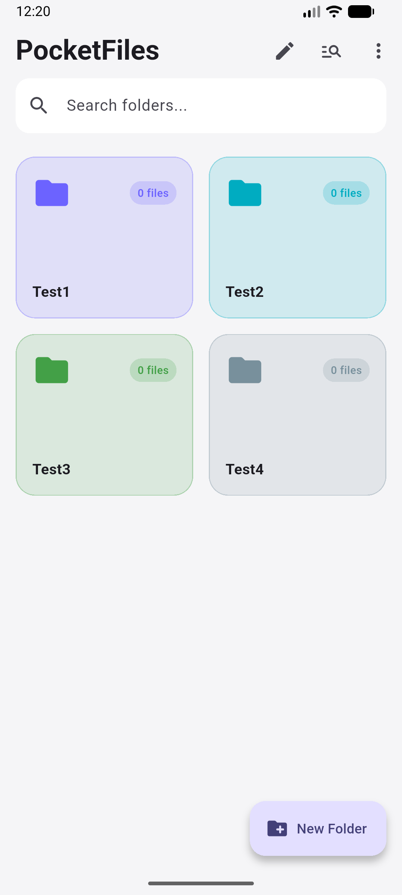 | 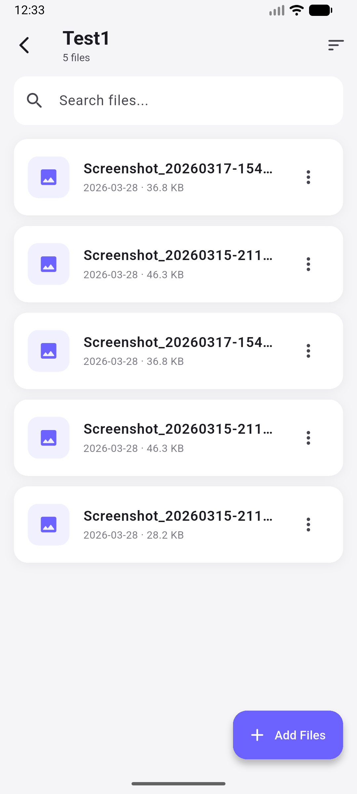 | 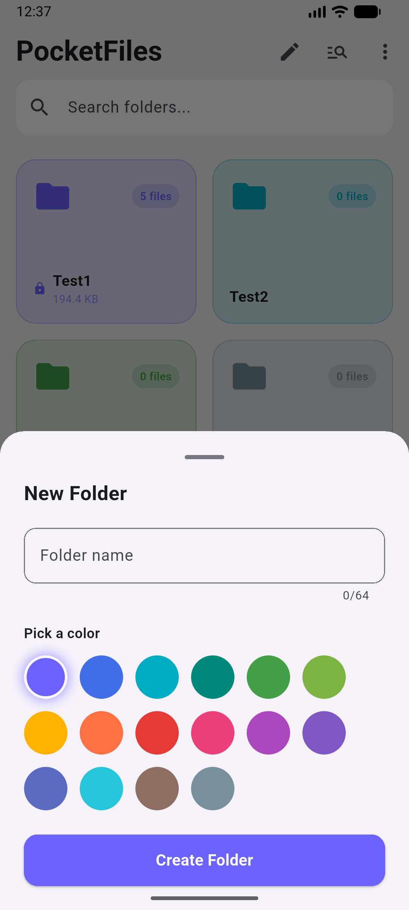 |

| Set PIN | Unlock | Global Search |
| --- | --- | --- |
| 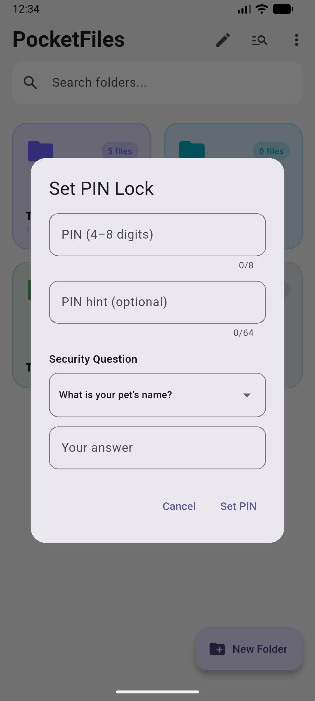 | 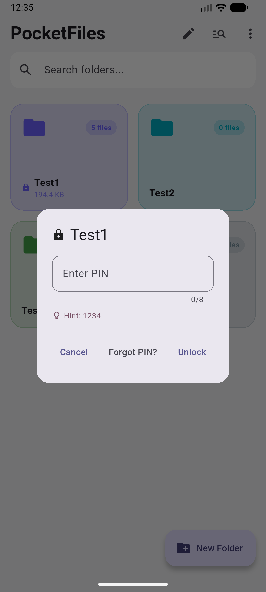 | 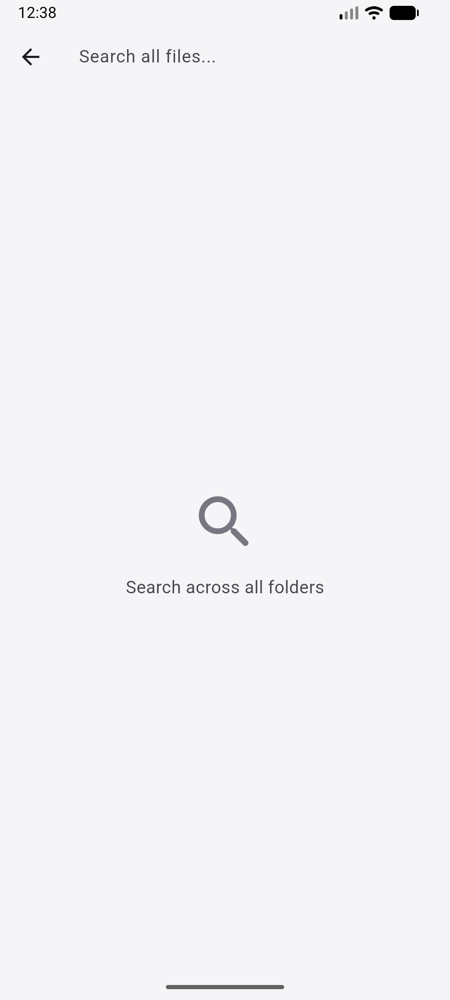 |

| Help Screen | Home (empty) | Home (dark) |
| --- | --- | --- |
| 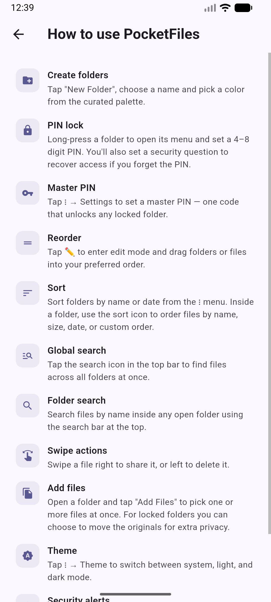 | 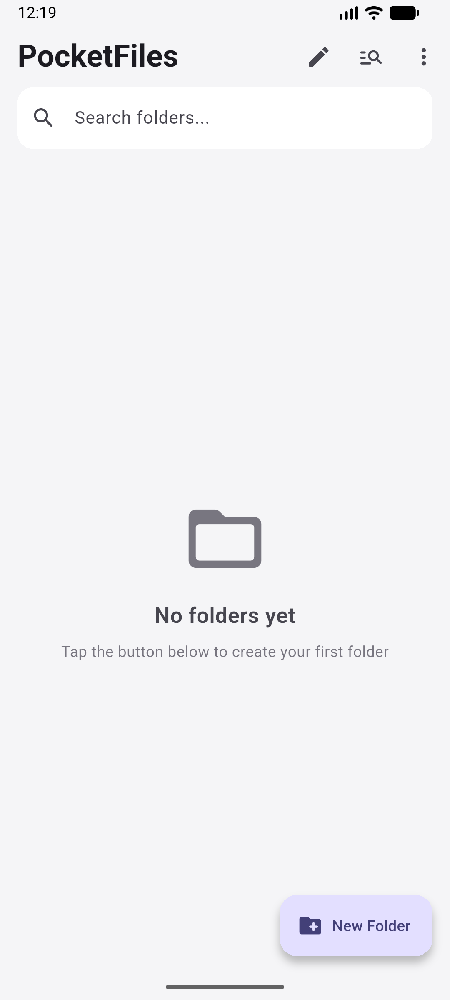 | 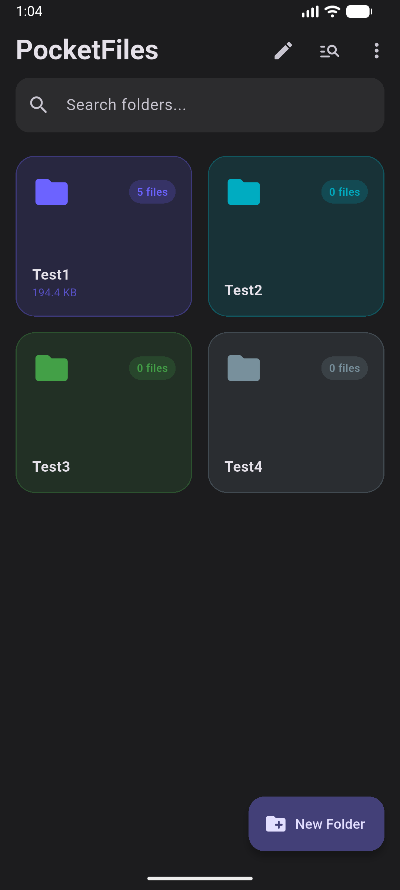 |

| Lockout | Forgot PIN | Security Alert | Folder Detail (dark) |
| --- | --- | --- | --- |
| 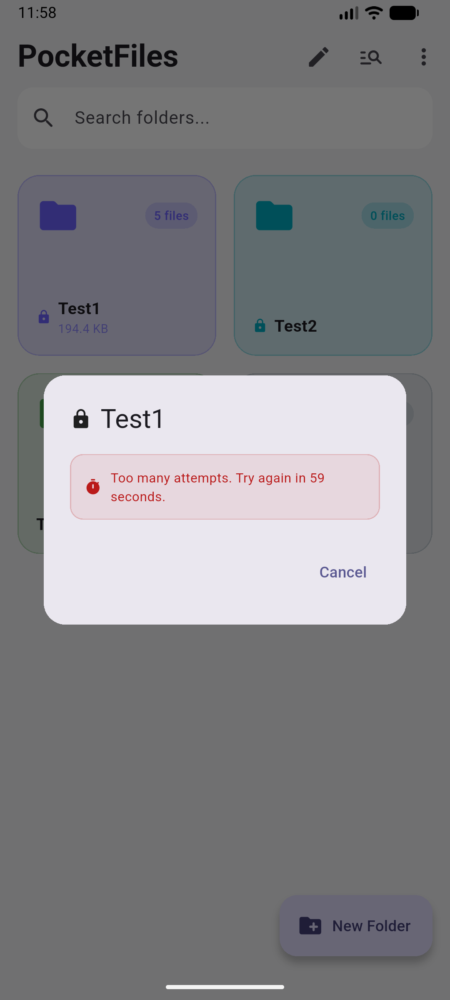 | 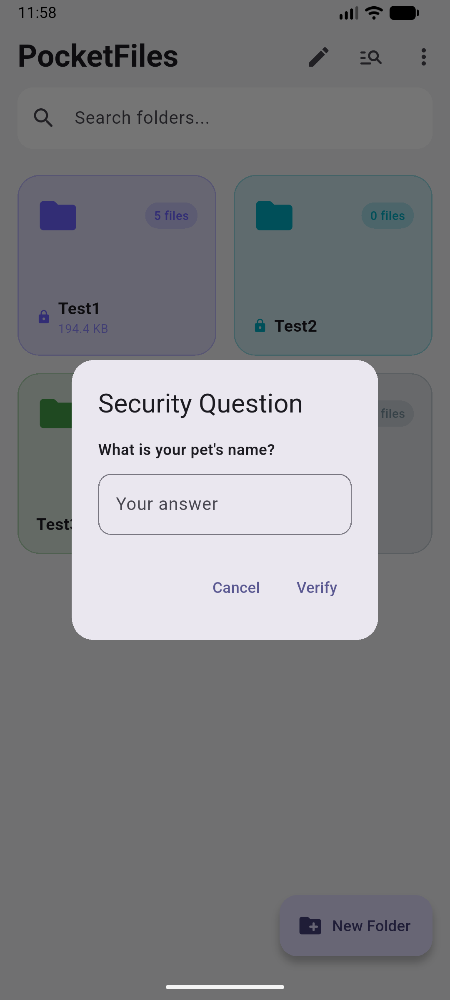 | 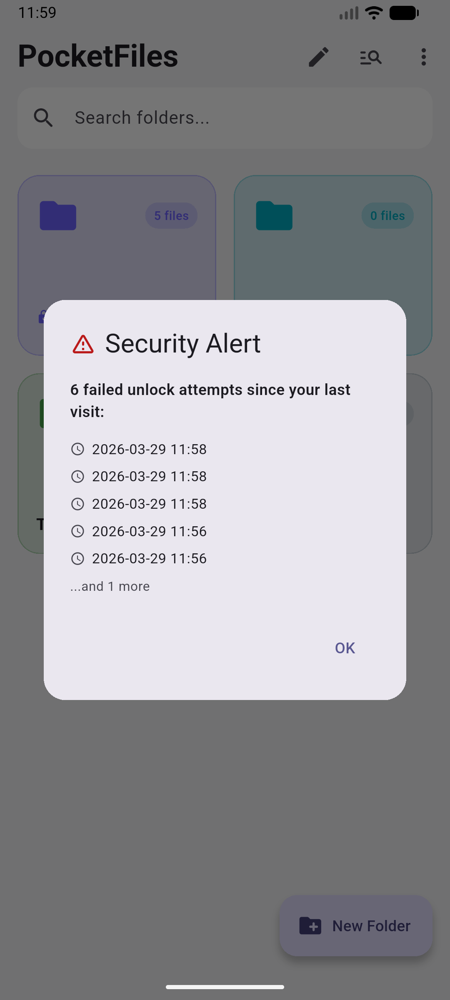 | 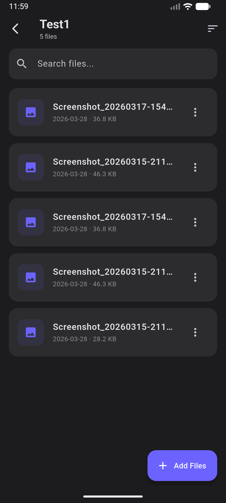 |

---

## Setup & Run

**Requirements:** Flutter SDK >= 3.0.0, Android device or emulator (iOS also supported)

```bash
git clone https://github.com/EmirageCS/pocketfiles.git
cd pocketfiles
flutter pub get
flutter run
```

Run tests:

```bash
flutter test
# 00:02 +148: All tests passed!
```

Build release APK:

```bash
flutter build apk --release
```

---

## Dependencies

| Package | Version | Purpose |
| --- | --- | --- |
| `sqflite` | ^2.3.3 | Local SQLite database |
| `bcrypt` | ^1.1.3 | PIN hashing, cost factor 10 |
| `file_picker` | ^8.1.2 | Multi-file import from device |
| `open_filex` | ^4.3.4 | Open files with native OS apps |
| `share_plus` | ^10.0.2 | Share files via system sheet |
| `path_provider` | ^2.1.2 | App documents directory |
| `path` | ^1.9.1 | Cross-platform path handling |
| `reorderable_grid` | ^1.0.13 | Drag-to-reorder folder grid |

---
